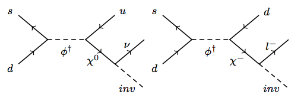

# LHE files for the monojet excess

See the [associated pdf](notes.pdf) with information on the excess and the processes for populating the SR and CRs.

Each LHE file contains ~10k events, with 5 files for each process, totaling ~50k events.

Files of the form inv\_XXX.lhe.gz populate the SR, while files of the form mu\_XXX.lhe.gz populate the W(>mu nu) CR. 

#### PDG CODES/PARTICLE CONTENTS:

The PDG codes are taken from particles in the MSSM that are most similar to particles in the monojet excess model. The PDG codes are as follows:

| field | PDG code
-------|---------
\phi |	2000002
\chi^0 |	1000022
\chi^+ |	1000024
inv   | 	1000012

For all samples, $M\_\phi$ and M\_\chi are fixed to be 1300 GeV and 900 GeV respectively, with the \chi^0 and \chi^+ masses fixed to be equal.

#### LHE FILE CONTENTS:

inv\_XXX.lhe.gz  

- samples for the left diagram in Figure 1 of the note.  
- geared towards populating the SR  
- for purposes of the simulation the \chi^0 is treated as stable since it decays only to invisible particles, such that the "inv" mass is irrelevant.

mu\_XXX.lhe.gz  

- samples for the right diagram in Figure 1 of the note.  
- geared towards populating the W(>mu nu) CR
- two values for the "inv" mass are taken. The 886 GeV point is better optimized for faking the W-boson (ie more efficient at getting events into the W-boson MT window)

#### CAVEATS/NOTES:

It should be further noted that the cross-sections according to MG5 can be disregarded, they are simply placeholders. The relative weights for events in inv\_XXX.lhe and mu\_XXX.lhe samples should be treated as equal, assuming that \chi^+ only decays to a muon and "inv".
